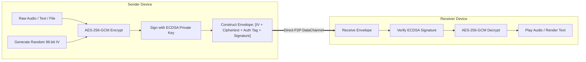

# 📻 Campus Walkie

> **Zero-Trust, End-to-End Encrypted, Peer-to-Peer Voice & Text Walkie-Talkie for the Web.**

[](https://ghost-101-ui.github.io/campus-walkie/)
[](https://www.typescriptlang.org/)
[](https://vitejs.dev/)
[](https://webrtc.org/)
[](https://workers.cloudflare.com/)
[](LICENSE)

🌐 **Live Demo:** [https://ghost-101-ui.github.io/campus-walkie/](https://ghost-101-ui.github.io/campus-walkie/)

**Campus Walkie** is a high-performance, browser-based Push-To-Talk (PTT) walkie-talkie and secure chat application. Built with a Neo-Brutalist + Engineering Notebook aesthetic, it enables instant, encrypted, low-latency communication over peer-to-peer (P2P) WebRTC mesh networks without central database persistence or backend message logging.

---

## 📐 System Architecture Overview

Campus Walkie uses a **hybrid P2P mesh network architecture**:
- **Signaling Server (Cloudflare Worker)**: Serves solely as a blind matchmaking relay to exchange WebRTC SDP offers/answers and ICE candidates. No room keys, audio, or message data ever touch the server.
- **Direct WebRTC Mesh**: Once peers discover each other, voice streams (MediaStreams) and text/files (DataChannels) travel **directly device-to-device**.

```mermaid
flowchart TB
    subgraph ClientA ["📱 Client A (User 1)"]
        UI_A["Neo-Brutalist UI"]
        Audio_A["WebAudio & Mic"]
        KDF_A["Web Worker KDF"]
        Crypto_A["AES-256-GCM / ECDSA"]
        WebRTC_A["RTCPeerConnection"]
    end

    subgraph Server ["⚡ Cloudflare Worker (Signaling Relay)"]
        WebSocketRelay["WebSocket Blind Matchmaker"]
    end

    subgraph ClientB ["📱 Client B (User 2)"]
        UI_B["Neo-Brutalist UI"]
        Audio_B["WebAudio & Speaker"]
        KDF_B["Web Worker KDF"]
        Crypto_B["AES-256-GCM / ECDSA"]
        WebRTC_B["RTCPeerConnection"]
    end

    %% Signaling phase
    UI_A -->|"1. Enter Channel & Key"| KDF_A
    UI_B -->|"1. Enter Channel & Key"| KDF_B
    WebRTC_A <-->|"2. Exchange SDP / ICE (WebSocket)"| WebSocketRelay
    WebSocketRelay <-->|"2. Exchange SDP / ICE (WebSocket)"| WebRTC_B

    %% Direct P2P phase
    WebRTC_A <===="3. Encrypted P2P Voice Stream (WebRTC MediaStream)"====> WebRTC_B
    WebRTC_A <===="4. Encrypted Text & File Transfer (RTCDataChannel)"====> WebRTC_B
```

---

## 🔐 Cryptography & Key Derivation Flow

Security in Campus Walkie is strictly **Zero-Knowledge** and **Client-Side Only**.

### 1. Key Derivation (PBKDF2-SHA256)
When a user enters a `#channel-name` and `Passphrase`:
1. A background Web Worker runs **PBKDF2-SHA256** with **100,000 iterations**.
2. A deterministic salt is computed from the channel name: `SHA-256("campus-walkie-salt:" + channelName)`.
3. The worker derives two distinct 256-bit cryptographic keys:
   - **`ChannelKey`**: AES-256-GCM master key used to encrypt/decrypt voice payloads and chat data.
   - **`ChannelId`**: Hashed room identifier sent to the signaling server so peers can find the same room without exposing the room's real name or passphrase.

```mermaid
sequenceDiagram
    autonumber
    actor User as User (Browser)
    participant UI as UI Component
    participant Worker as KDF Web Worker
    participant Crypto as Web Crypto API
    participant Sig as Signaling Server

    User->>UI: Enter Channel Name & Secret Passphrase
    UI->>Worker: Pass (channelName, passphrase)
    Note over Worker: Compute Salt = SHA256("salt:" + channelName)
    Worker->>Crypto: Derive Bits (PBKDF2-SHA256, 100k iterations)
    Crypto-->>Worker: Derived 512 bits
    Note over Worker: Split into ChannelKey (256-bit) & ChannelId (256-bit)
    Worker-->>UI: Return (ChannelKey, ChannelId)
    UI->>Sig: Connect WebSocket to Room (ChannelId)
    Note over Sig: Room ID is hashed; server cannot guess Passphrase or Channel Name
```

---

## 🎙️ Voice & Text Message Encryption Lifecycle

Every text message, audio frame, and file payload is encrypted using **AES-256-GCM** and signed with an ephemeral **ECDSA P-256** session signature.



---

## 🔄 Peer Discovery & WebRTC Connection Lifecycle

How two devices discover each other and form a direct P2P mesh:

```mermaid
sequenceDiagram
    autonumber
    actor ClientA as Phone A
    participant Relay as Cloudflare Worker Relay
    actor ClientB as Phone B

    ClientA->>Relay: WS Connect /join?room=ChannelId
    ClientB->>Relay: WS Connect /join?room=ChannelId
    Relay-->>ClientA: Welcome (Peers list: [Phone B])
    Relay-->>ClientB: Peer Joined (Phone A)

    Note over ClientA,ClientB: WebRTC Handshake Initiation
    ClientA->>Relay: Send SDP Offer (Encrypted payload)
    Relay->>ClientB: Forward SDP Offer
    ClientB->>Relay: Send SDP Answer
    Relay->>ClientA: Forward SDP Answer

    ClientA->>Relay: Send ICE Candidates
    Relay->>ClientB: Forward ICE Candidates
    ClientB->>Relay: Send ICE Candidates
    Relay->>ClientA: Forward ICE Candidates

    Note over ClientA,ClientB: Direct WebRTC Connection Established (Relay disconnected from audio)
    ClientA<===>ClientB: P2P Encrypted Audio Stream & DataChannel
```

---

## ✨ Features Breakdown

- 🎙️ **Physical Push-To-Talk (PTT)**: Low-latency voice streaming over WebAudio & WebRTC with real-time canvas waveform visualizer, half-duplex locks, and active talker indicator.
- 🔒 **End-to-End Encryption (E2EE)**: Zero-knowledge architecture using Web Crypto API, PBKDF2-SHA256 key derivation (100,000 iterations), and AES-256-GCM ciphers. Private keys never touch any server.
- 💬 **Smart Timeline Chat**: Linear/Slack-style messaging with file attachment transfer over chunked P2P DataChannels.
- 📱 **Responsive Neo-Brutalist UI**: 
  - **Desktop**: 3-column layout (Left: Peer List, Center: Hero PTT & Timeline, Right: Security & Relays).
  - **Mobile View**: 3-tab switcher (`PTT` | `CHAT` | `PEERS`) with zero-interruption in-place DOM node persistence.
- 🛡️ **Hybrid Secure Invite System**:
  - **📷 Instant-Join QR Code**: Camera-scannable QR code containing temporary key for fast in-person pairing.
  - **🔒 Safe Share Link**: Excludes secret key for safe texting/emailing (prompts recipient for passcode upon joining).
- 🚨 **Panic & Security Controls**:
  - **Panic Button**: Instant wipe of local state, session storage, and active WebRTC mesh keys.
  - **Safety Word Grid**: Out-of-band key verification matrix.
- ⚡ **Serverless P2P Signaling**: Lightweight Cloudflare Worker signaling relay for peer discovery with zero data logging.

---

## 🛠️ Technology Stack

| Component | Technology |
| :--- | :--- |
| **Language** | TypeScript (Strict mode) |
| **Build System** | Vite |
| **Realtime Mesh** | WebRTC (`RTCPeerConnection`, `RTCDataChannel`) |
| **Audio Processing** | Web Audio API (`AudioContext`, `MediaStream`, Canvas visualizer) |
| **Cryptography** | Web Crypto API (AES-256-GCM), PBKDF2 Web Worker KDF |
| **Signaling Relay** | Cloudflare Workers (`signaling/src/index.ts`) |
| **Styling** | Vanilla CSS3 (Custom Brutalist Design Tokens) |

---

## 🚀 Quick Start

### Prerequisites
- [Node.js](https://nodejs.org/) (v18+ recommended)
- `npm` or `pnpm`

### Installation

1. **Clone the repository:**
   ```bash
   git clone https://github.com/Ghost-101-ui/campus-walkie.git
   cd campus-walkie
   ```

2. **Install dependencies:**
   ```bash
   npm install
   ```

3. **Start local development server:**
   ```bash
   npm run dev
   ```
   Open your browser at `http://localhost:5173`.

4. **Build for production:**
   ```bash
   npm run build
   ```

5. **Typecheck codebase:**
   ```bash
   npm run typecheck
   ```

---

## 📁 Repository Structure

```
campus-walkie/
├── public/                # Static assets & icons (group.png, voice-chat.png, etc.)
├── signaling/             # Cloudflare Workers Signaling Backend
│   ├── src/index.ts       # WebSocket signaling relay server
│   └── wrangler.jsonc     # Cloudflare deployment configuration
├── src/
│   ├── audio/             # Mic capture, playback queue & canvas meter
│   │   ├── ptt.ts
│   │   └── playback.ts
│   ├── components/        # Reusable UI widgets
│   ├── crypto/            # Key derivation & Web Worker encryption
│   │   ├── kdf.ts
│   │   └── identity.ts
│   ├── net/               # WebRTC Mesh & Signaling Client
│   │   ├── mesh.ts
│   │   ├── signaling.ts
│   │   └── datachannel.ts
│   ├── ui/                # Brutalist UI Views & Modals
│   │   ├── join.ts        # State 1: Join Screen
│   │   ├── channel.ts     # State 2: Channel Grid & Mobile Views
│   │   ├── chat.ts        # Smart Chat Timeline
│   │   ├── qr.ts          # Canvas QR Code Generator
│   │   └── dom.ts         # Lightweight DOM helper utilities
│   ├── main.ts            # Application Entry & State Manager
│   └── index.css          # Core Brutalist Design System & Media Queries
└── index.html             # Main HTML Template
```

---

## 📜 License

Distributed under the MIT License. See `LICENSE` for more information.
